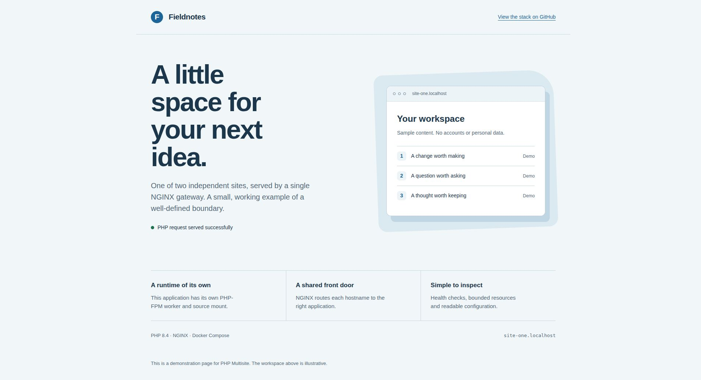
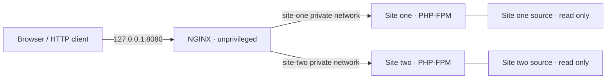
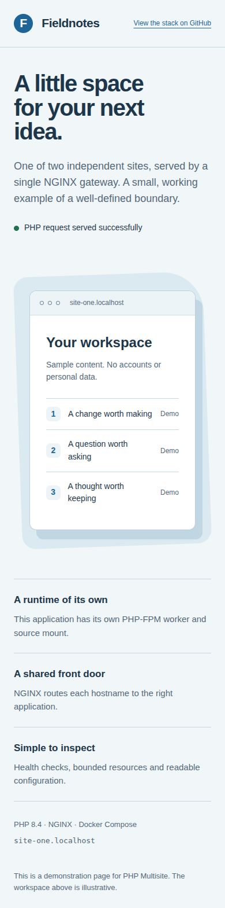
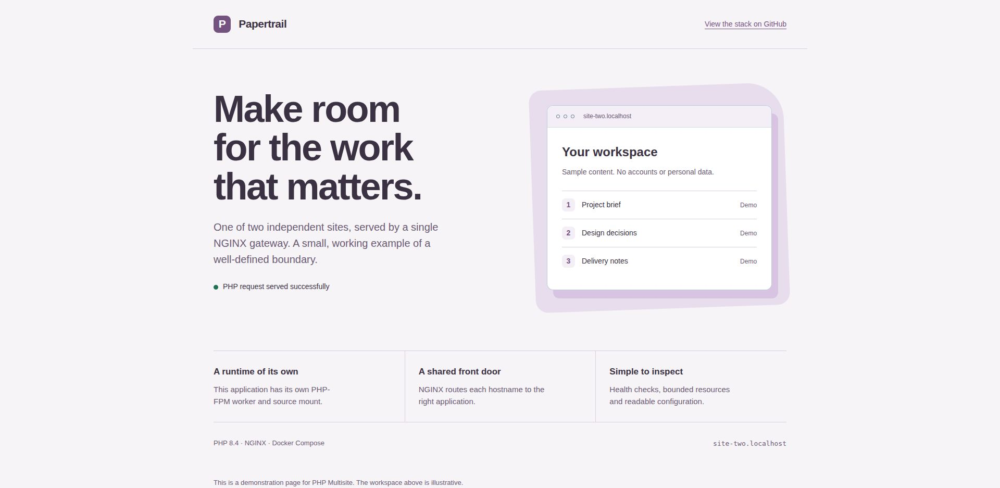

# PHP Multisite

Two independent PHP applications behind one NGINX gateway, with Docker Compose, isolated workers and optional local HTTPS. A small, inspectable foundation for understanding how hostname routing, PHP-FPM and container boundaries fit together.



## What this example demonstrates

- **Hostname routing:** one published gateway serves two distinct document roots.
- **Separate runtimes:** each site gets its own PHP-FPM container, private network and read-only source mount.
- **Restricted containers:** non-root processes, dropped capabilities, read-only filesystems, bounded memory and process counts.
- **Predictable failure:** unknown hosts return 404; hidden files are denied; nonexistent PHP scripts never reach FPM.
- **Observable startup:** NGINX and both PHP workers have health checks; logs go to standard output/error.
- **Verifiable behavior:** HTTP routing, response headers, isolation and certificate validation run in CI.

The two responsive pages are intentionally small demonstrations. Their illustrated workspaces are sample content, not a separate application or a live customer system.

## Run locally

Requires Docker Engine or Docker Desktop with the Compose plugin. Python 3 is only needed for the HTTP tests; OpenSSL and curl are needed for the optional HTTPS checks.

```sh
git clone https://github.com/Pablo-Camara/simple-multi-site-docker-compose-nginx-alpine-php-fpm-alpine-https-ssl-certificates.git
cd simple-multi-site-docker-compose-nginx-alpine-php-fpm-alpine-https-ssl-certificates
docker compose up --build --wait
```

Open [Fieldnotes](http://site-one.localhost:8080) or [Papertrail](http://site-two.localhost:8080). Chrome and Firefox resolve these `.localhost` names to the local machine. If your client does not, add `127.0.0.1 site-one.localhost site-two.localhost` to your hosts file.

The gateway binds to **127.0.0.1**, so the default setup is reachable only from your computer. No database, account, external API key or host PHP installation is required.

```sh
# Use another port if 8080 is occupied.
HTTP_PORT=9080 docker compose up --build --wait

# Inspect status and logs; stop only this project's stack.
docker compose ps
docker compose logs --tail 100
docker compose down
```

For persistent overrides, copy `.env.example` to `.env` and edit it. Keep the same port settings when running tests. If Docker reports exhausted address pools, choose unused subnets in a local Compose override; do not prune unrelated networks.

## Architecture



NGINX joins an edge network for published ports and both internal worker networks. Workers cannot resolve one another and have no external network. NGINX can read both document roots to serve static files and verify script existence; a worker only receives its own source directory.

The internal networks are an explicit tradeoff: applications that need a database, mail or an external API need an intentionally configured connection. Containers on the same host share a kernel; this is not a hostile-tenant sandbox.

| Location | Responsibility |
| --- | --- |
| `docker-compose.yml` | Services, networks, health checks and runtime restrictions |
| `docker/nginx/conf.d/default.conf` | Hostname-to-application mapping |
| `docker/nginx/snippets/site.conf` | Shared routing and response policy |
| `docker/php-fpm/` | PHP image, production-oriented PHP defaults and worker limits |
| `sites/*/root/public/` | Independent public document roots |
| `sites/assets/` | Shared CSS for the example pages |
| `scripts/` | HTTP, isolation and TLS verification |

The stack uses PHP 8.4 and NGINX 1.28 Alpine image lines. Tags receive patch updates; Dependabot proposes image and workflow updates. To reproduce an exact release in your own deployment, pin image digests and maintain an update process.

## Verify the stack

With the HTTP stack running:

```sh
python3 scripts/smoke-test.py
scripts/check-isolation.sh
```

The tests exercise both real PHP responses, blocked dotfiles, missing paths, unknown hosts, security headers, static assets and liveness. Isolation checks verify non-root users, read-only filesystems and separate worker DNS scopes. `/healthz` is NGINX liveness; the worker health checks separately exercise FPM's ping endpoint.

The same checks run in [the verification workflow](.github/workflows/verify.yml), followed by HTTPS validation. They cover this example's contract, not the correctness of applications you add later.

## Optional local HTTPS

Start the HTTP stack first, then generate a **local demonstration certificate**:

```sh
scripts/local-certificate.sh
docker compose -f docker-compose.yml -f compose.tls.yml up --wait
scripts/check-tls.sh
```

The script creates a certificate valid for 30 days and both `.localhost` hosts. It refuses to overwrite existing files. The private key is readable only by the image's NGINX user (UID 101), and the directory is ignored by Git. A short-lived Docker helper sets that ownership; no key is printed or committed.

`check-tls.sh` verifies both hosts using `curl --cacert` and checks that an unknown HTTP Host is rejected. It does **not** disable certificate validation. The certificate is not automatically trusted by your browser or operating system; use the HTTP preview unless you have deliberately configured local trust.

Use `HTTPS_PORT` to change 8443. HTTP remains available alongside HTTPS for this example. A real deployment should use trusted certificates and an explicit redirect/renewal policy.

## Adapt it to your application

1. Replace a site's public files and update its `server_name` values.
2. Add required PHP extensions in `docker/php-fpm/Dockerfile`; rebuild the image.
3. For a framework, mount the application outside the public document root and configure its front controller deliberately. The example does not route every missing URL to `index.php`.
4. Add narrowly scoped writable volumes for framework caches, sessions or uploads. The sample applications need none.
5. Adjust PHP worker count, memory limits and timeouts against measured workload. The provided limits suit the demonstration, not every production workload.
6. Copy the worker service and private network when adding a third application; then add its matching NGINX host configuration and tests.

Before an Internet-facing deployment, provision real certificates, configure backups and log retention, review the content security policy for your application, define resource budgets and decide how ingress, renewal and updates are operated. Binding to a public address requires an explicit `BIND_ADDRESS` change. No certificate renewal, database, deployment automation or high availability is provided here.

## Screenshots

Actual captures of the running example pages in Chrome. Mobile layout is checked at 390 px and a narrow 320 px viewport.





## Migrating from the original example

The repository name and Git history are retained. The refreshed example changes the default host port from 80 to 8080, replaces the shared PHP worker with one per site, and moves virtual-host configuration into `docker/nginx/`. Old `site-one.com` and `site-two.com` host aliases still work over HTTP, but the example certificate covers only the `.localhost` names.

Previously committed certificates are no longer part of the working tree. Treat anything stored in Git history as public and replace any old key that was used outside the demo. Back up custom site configuration before adopting this layout; this is not an in-place production upgrade script.

## License

[MIT](LICENSE).
